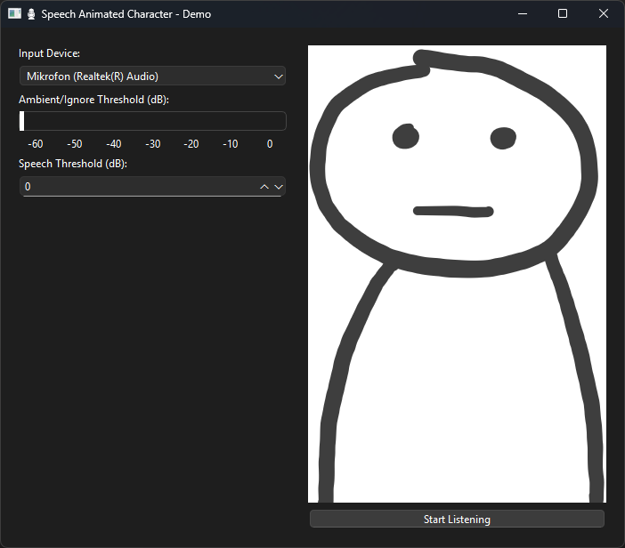

# Usage
## Running the program
To run the program we first need to create the virtual environment (venv)
1. `CTRL + Shift + P`
2. Search `Run Task`
3. Now click on `Create venv`, then `Install requirements`
   
Then we activate it with in cmd (or any other terminal) using

4. `.venv\Scripts\activate`

Now, you should be able to run the application with

5. `python -m app.src.main `

If everything worked correctly, you should see this window:

## Settings
Now you can adjust the settings before starting. Most importantly the selection of the correct audio input device and threshold for audio detection.

If speech threshold is set to zero, the character will be animated with a completely opened mouth. By increasing the value, you can create a stage between closed mouth to opened mouth, where the mouth is animated using random half opened mouths.

Settings that worked well for me personally where:

- Ambient/Ignore: -45
- Speech: 8 (-37)

## Result
Pressing `Start Listening` will start the application.

## Customization
The project contains a [config](app/assets/configuration/config.json) json file, which determines which images to use. You can paste your own pictures in the [/assets/frames](app/assets/frames) directory and replace the `active_preset` with your newly created `preset` in `presets`.
